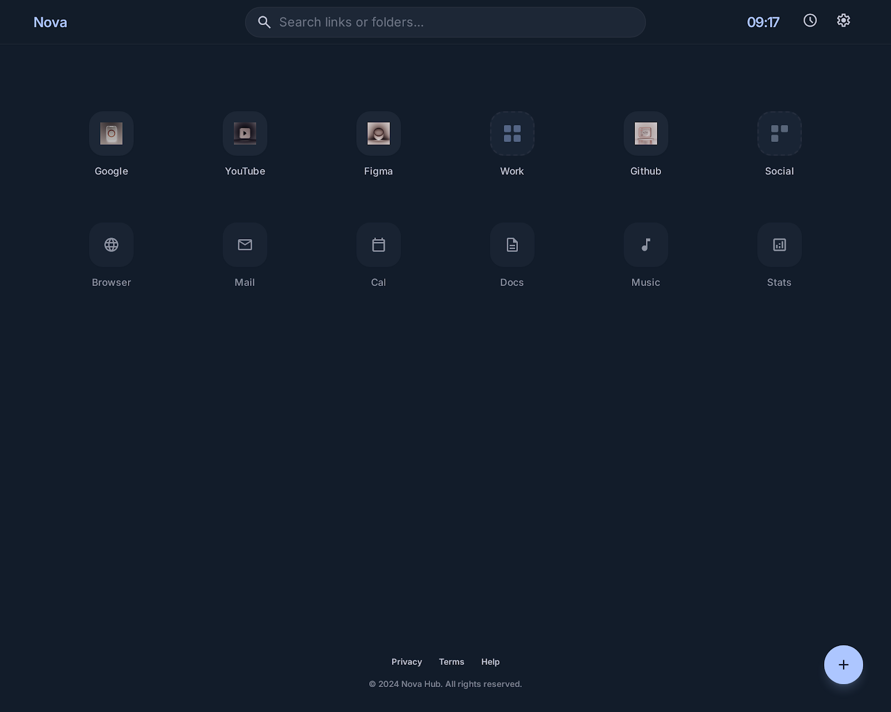
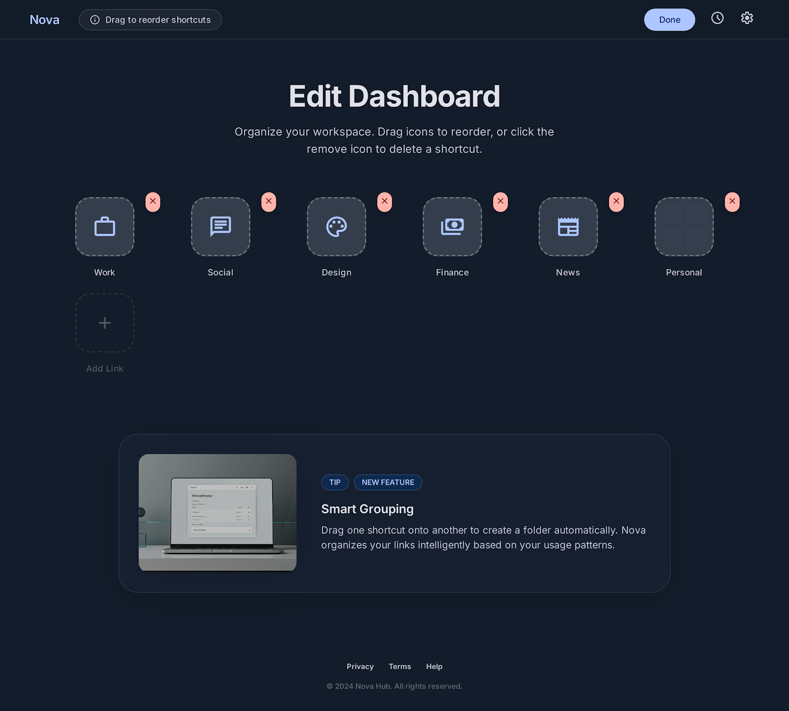
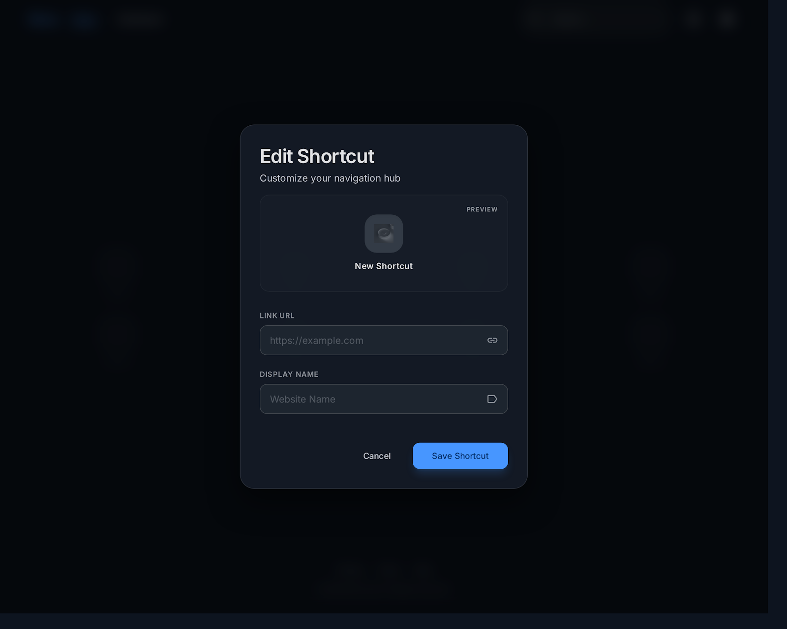
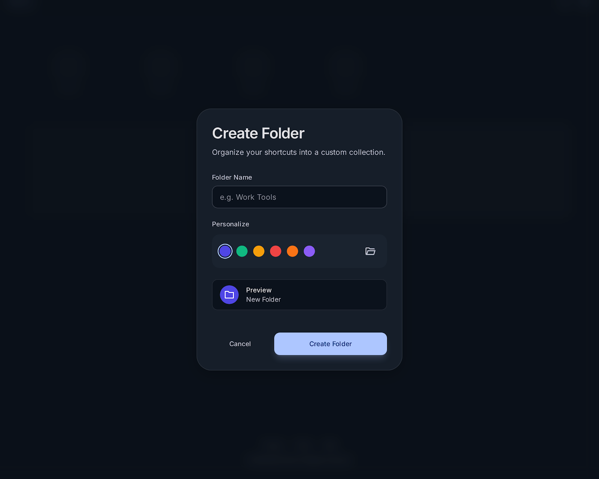
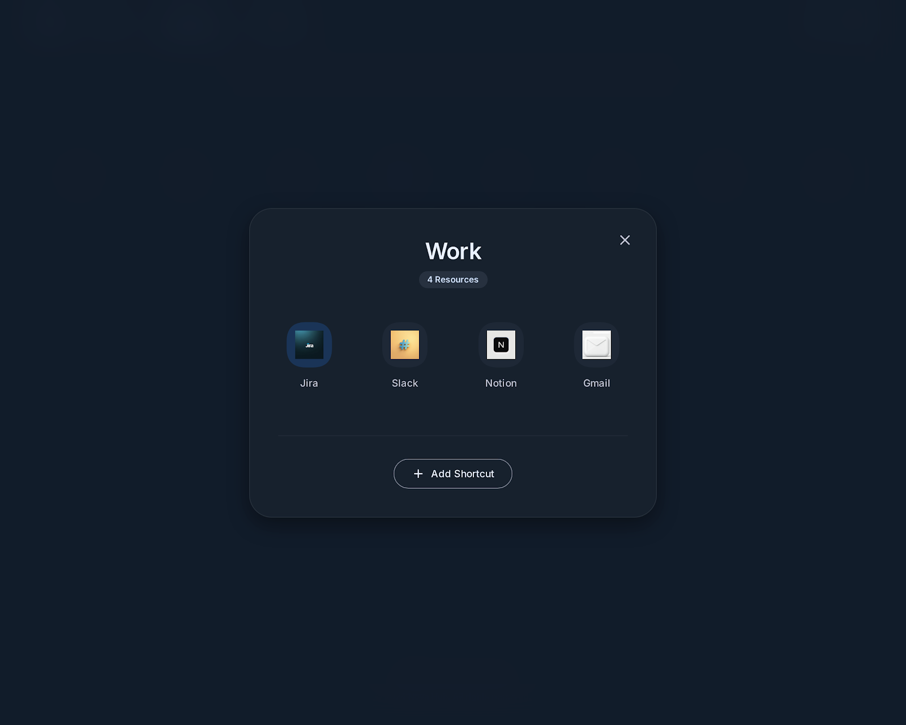

<p align="center">
  
</p>

<h1 align="center">✦ LinkHub ✦</h1>

<p align="center">
  <b>Hub centralizador de atalhos para o navegador</b><br>
  Substitua sua nova aba por um painel elegante com atalhos, pastas, busca global e muito mais.
</p>

<p align="center">
  
  
  
  
</p>

<br>

---

## 📸 Preview

<table>
  <tr>
    <td align="center" width="50%">
      <strong>Dashboard Principal</strong><br>
      
    </td>
    <td align="center" width="50%">
      <strong>Modo Edição</strong><br>
      
    </td>
  </tr>
  <tr>
    <td align="center" width="50%">
      <strong>Criar Atalho</strong><br>
      
    </td>
    <td align="center" width="50%">
      <strong>Criar Pasta</strong><br>
      
    </td>
  </tr>
  <tr>
    <td align="center" colspan="2">
      <strong>Visualização de Pasta</strong><br>
      
    </td>
  </tr>
</table>

---

## ✨ Funcionalidades

- **📌 Atalhos organizados** — Grid de squircles com favicons automáticos
- **📁 Pastas coloridas** — Agrupe atalhos em pastas com 6 cores disponíveis
- **🔍 Busca global** — Pesquise atalhos e pastas em **todas as guias** de uma vez
- **📑 Múltiplas guias** — Sidebar com guias reordenáveis por drag & drop
- **✏️ Modo edição** — Animações wiggle, botões de editar/remover, drag para reordenar
- **🔄 Drag & Drop nativo** — Reordenar itens, arrastar links para pastas, reorganizar guias
- **🌐 Web Search** — Barra de pesquisa com sugestões, seletor de motor (Google, Bing, DuckDuckGo, Yahoo, Brave) e animação expansiva
- **⏰ Relógio digital** — Exibição HH:MM no header (configurável)
- **⚙️ Painel personalizável** — Mostrar/esconder relógio, barra de busca e pesquisa web
- **📐 Posição da sidebar** — Escolha entre esquerda, direita, superior ou inferior
- **💾 Export / Import** — Backup completo dos dados em JSON (inclui configurações)
- **🎨 7 Temas** — Escolha entre Ultra Glass, Obsidian, Prism, Aurora, Terminal, Monochrome e Sahara
- **📱 Responsivo** — Layout adaptável para diferentes tamanhos de tela

---

## 🚀 Como Instalar no Chrome

### Método 1: Extensão Chrome (Nova Aba)

> ⚠️ **Requer:** Google Chrome, Microsoft Edge, Brave, Opera ou qualquer navegador baseado em Chromium.

1. **Baixe o projeto** — Clone ou faça download do repositório:
   ```bash
   git clone https://github.com/seu-usuario/linkhub.git
   ```
   Ou baixe o ZIP e extraia em uma pasta.

2. **Abra o gerenciador de extensões** do seu navegador:
   - Chrome: `chrome://extensions/`
   - Edge: `edge://extensions/`
   - Brave: `brave://extensions/`
   - Opera: `opera://extensions/`

3. **Ative o "Modo do desenvolvedor"** (canto superior direito).

4. **Clique em "Carregar sem compactação"** e selecione a pasta `linkhub/` do projeto.

5. **Pronto!** Abra uma nova aba e o LinkHub aparecerá automaticamente.

<p align="center">
  
</p>

---

### Método 2: SPA (Sem instalação)

Abra o arquivo `linkhub/index.html` diretamente no navegador com duplo clique.

> **Nota:** Neste modo, os dados persistem via `localStorage` normalmente, mas alguns recursos de extensão (como `chrome.storage`) não estarão disponíveis.

---

### Método 3: Atalho Windows

Execute o arquivo `abrir-linkhub.bat` para abrir o LinkHub rapidamente no seu navegador padrão.

---

## 🎮 Como Usar

### Interface Principal

| Elemento | Descrição |
|----------|-----------|
| **Sidebar** | Navegue entre guias. Clique em "+" para adicionar nova guia. Arraste para reordenar. |
| **Grid de Atalhos** | Seus links favoritos em formato squircle com favicon. |
| **Pastas** | Cards coloridos que agrupam atalhos por categoria. |
| **Busca** | Pesquise por nome ou URL em todas as guias simultaneamente. |
| **Relógio** | Exibição digital no canto superior direito (pode ser desativado). |
| **Web Search** | Barra fixa no canto inferior. Ao focar, expande para o centro com sugestões. |

### Personalização

Acesse **⚙️ > Personalizar** ou clique com direito em área vazia > **Personalizar**:

- ✅ **Mostrar relógio** — Ativa/desativa o relógio no header
- ✅ **Mostrar barra de busca** — Ativa/desativa a busca de atalhos
- ✅ **Mostrar pesquisa web** — Ativa/desativa a barra de pesquisa web
- 🎨 **Tema** — Ultra Glass, Obsidian, Prism, Aurora, Terminal, Monochrome ou Sahara
- 📐 **Posição da sidebar** — Esquerda, Direita, Superior ou Inferior

Todas as configurações são salvas automaticamente e incluídas no backup JSON.

### Botão ⚙️ (FAB)

Clique no ícone de engrenagem no canto inferior direito para:

- ➕ **Novo atalho** — Adicione um link com nome e favicon automático
- 📁 **Nova pasta** — Crie uma pasta com cor personalizada
- ✏️ **Editar painel** — Ative o modo edição com wiggle e drag
- ⚙️ **Personalizar** — Configure visibilidade e posição da sidebar
- 📤 **Exportar dados** — Baixe backup JSON de todos os seus dados
- 📥 **Importar dados** — Restaure dados de um arquivo JSON

### Clique Direito (Context Menu)

| Onde clicar | Opções disponíveis |
|-------------|-------------------|
| **Atalho** | Editar, Remover |
| **Pasta** | Abrir, Editar, Remover |
| **Guia (sidebar)** | Editar, Remover |
| **Área vazia** | Novo atalho, Nova pasta, Editar painel, **Personalizar** |

### Web Search

- **Seletor de motor**: clique no ícone do motor ao lado da lupa para alternar entre Google, Bing, DuckDuckGo, Yahoo e Brave
- **Sugestões**: ao digitar, aparecem sugestões baseadas em seus links salvos e pesquisas recentes
- **Navegação por teclado**: use ArrowUp/ArrowDown para navegar nas sugestões, Enter para buscar

### Pastas

- Clique em uma pasta para abrir a visualização dos atalhos internos
- Arraste um link **diretamente sobre uma pasta** para movê-lo para dentro dela
- Na visualização da pasta, você também pode adicionar novos atalhos e reordená-los

---

## 🗂️ Estrutura do Projeto

```
linkhub/
├── index.html              # Página principal (nova aba)
├── manifest.json           # Manifest V3 da extensão Chrome
├── background.js           # Service worker
├── CONTEXT_PROJECT.md      # Documentação técnica do projeto
├── abrir-linkhub.bat       # Atalho Windows
│
├── assets/                 # Ícones da extensão
│   ├── icon-16.png
│   ├── icon-48.png
│   └── icon-128.png
│
├── css/                    # Folhas de estilo
│   ├── variables.css       # Design tokens (tema padrão Ultra Glass)
│   ├── base.css            # Reset, glass-panel, squircle, bg-blobs
│   ├── layout.css          # Sidebar, header, grid, posições, toggles
│   ├── components.css      # Shortcuts, folders, FAB, context menu, settings modal
│   ├── modals.css          # Overlays e animações de modais
│   ├── edit-mode.css       # Modo edição, drag, wiggle
│   ├── theme-obsidian.css  # Tema: Obsidian (OLED escuro)
│   ├── theme-prism.css     # Tema: Prism (claro)
│   ├── theme-aurora.css    # Tema: Aurora (teal escuro)
│   ├── theme-terminal.css  # Tema: Terminal (cyan escuro)
│   ├── theme-monochrome.css# Tema: Monochrome (escala de cinza)
│   └── theme-sahara.css    # Tema: Sahara (quente claro)
│
└── js/                     # Scripts
    ├── app.js              # Bootstrap, orquestração, applySettings
    ├── storage.js          # CRUD localStorage, schema, migração, export/import, settings
    ├── render.js           # Renderização DOM
    ├── drag.js             # Drag & Drop nativo
    ├── search.js           # Filtro em tempo real
    ├── clock.js            # Relógio digital
    ├── modals.js           # Modais, FAB, context menus, settings modal
    └── edit-mode.js        # Modo edição
```

---

## 🛠️ Tecnologias Utilizadas

| Tecnologia | Finalidade |
|------------|-----------|
| **Chrome Manifest V3** | Extensão para navegadores Chromium |
| **HTML5** | Estrutura da página |
| **CSS3** | Design system com variáveis, glassmorphism, 7 temas, animações |
| **JavaScript (Vanilla)** | Toda a lógica — zero frameworks |
| **localStorage** | Persistência de dados |
| **Google Fonts CDN** | Inter, Hanken Grotesk, Geist, Sora, JetBrains Mono, Space Grotesk, EB Garamond, Manrope, Material Symbols |
| **Google S2 Favicons** | Favicons automáticos dos atalhos e logos dos motores |

---

## 📦 Dados e Persistência

Seus dados são salvos automaticamente no `localStorage` do navegador com a chave `linkhub-v1`.

- ✅ **Backup manual**: Use o menu ⚙️ > **Exportar dados** para baixar um JSON
- ✅ **Restauração**: Use o menu ⚙️ > **Importar dados** para carregar um backup
- ✅ **Configurações inclusas**: Preferências de layout e visibilidade são salvas e exportadas
- ✅ **Migração automática**: Dados do schema v1 são migrados para v2 automaticamente
- ❌ **Não use** `chrome.storage.sync` — os dados ficam apenas no navegador local

---

## 🔒 Permissões da Extensão

| Permissão | Motivo |
|-----------|--------|
| `storage` | Persistir dados localmente |
| `https://fonts.googleapis.com/*` | Carregar fontes do Google |
| `https://fonts.gstatic.com/*` | Carregar arquivos de fonte |
| `https://www.google.com/s2/favicons/*` | Buscar favicons dos atalhos e logos |

Nenhum dado pessoal é coletado, enviado ou compartilhado.

---

## 🧠 Por que LinkHub?

- ✅ **Sem frameworks** — JavaScript puro, carregamento instantâneo
- ✅ **Sem contas** — 100% offline, sem servidor, sem cadastro
- ✅ **Sem anúncios** — Seu espaço, seu controle
- ✅ **Leve** — Menos de 50KB de código
- ✅ **Customizável** — Crie quantas guias e pastas quiser, personalize layout e visibilidade
- ✅ **Estiloso** — 7 temas entre dark e light com glassmorphism e neon glows

---

## 📄 Licença

Distribuído sob a licença **MIT**. Veja o arquivo `LICENSE` para mais informações.

---

<p align="center">
  Feito com 💜 para organizar seu navegador<br>
  <sub>LinkHub — Seu hub de atalhos pessoal</sub>
</p>
